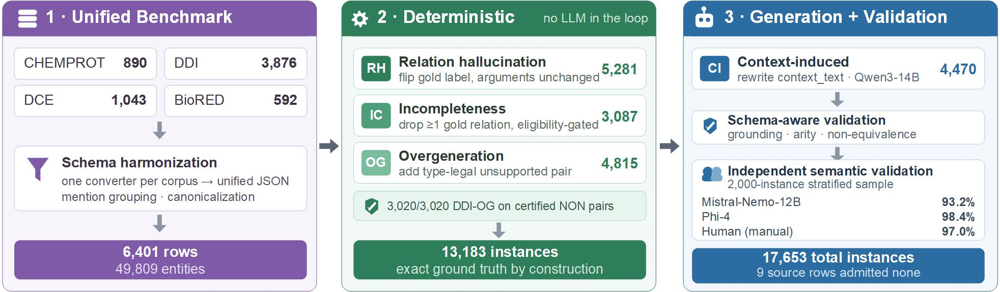

# HalluRE-Med

**HalluRE-Med** is a benchmark suite for evaluating large language models (LLMs) on **biomedical relation extraction (RE)**, with a focus on both **extraction quality** and **hallucination robustness**. It measures not only whether a model can extract structured biomedical relations, but also whether those predictions are semantically reliable.

<!-- Paper: *HalluRE-Med: A Unified Benchmark for Evaluating Hallucinations in Large Language Models for Biomedical Relation Extraction* (IEEE JBHI).  -->

This repository releases **two benchmarks** and the **code used to build and evaluate them**:

- **Unified Biomedical RE Benchmark** — a standardized benchmark for end-to-end biomedical relation extraction across four datasets: **CHEMPROT**, **DDI**, **DCE**, and **BioRED** (6,401 source rows, 49,809 entities, 44,327 relation annotations).
- **HalluRE-Med Benchmark** — a structured hallucination benchmark derived from the unified RE benchmark (17,653 schema-valid instances), testing model robustness against schema-valid but semantically incorrect biomedical relations across four categories: **relation hallucination**, **incompleteness**, **overgeneration**, and **context-induced hallucination**.



*Figure: overview of the HalluRE-Med pipeline.* 
<!-- Your comment here (1) Four source corpora are harmonized into a unified benchmark (6,401 rows, 49,809 entities). (2) Three hallucination categories — relation hallucination (RH), #incompleteness (IC), and overgeneration (OG) — are constructed deterministically from gold relations with no LLM in the loop (13,183 instances, exact ground #truth by construction). (3) The fourth category, context-induced hallucination (CI), is generated with Qwen3-14B and passed through schema-aware and independent #semantic validation, yielding 17,653 total instances (9 source rows admitted none).*-->

## Available Now
- Unified Biomedical RE Benchmark
- HalluRE-Med Benchmark
- Full pipeline code: benchmark construction, end-to-end RE evaluation, hallucination detection evaluation, and independent semantic validation (this release)

## Repository Contents

| File | Purpose |
|---|---|
| `generate_re_hallu.py` | Builds the HalluRE-Med hallucination benchmark from the unified RE benchmark. Relation hallucination, incompleteness, and overgeneration are deterministic, rule-based transformations of gold relations (no LLM). Context-induced hallucination is generated with an LLM (e.g. Qwen3-14B) via vLLM. |
| `run_e2e_llm.py` | Runs and scores end-to-end / oracle-entity biomedical RE evaluation on the unified benchmark (`text_only` and `oracle_entities` modes; strict/lenient/both scoring; micro and macro F1; bootstrap CIs; per-density and per-length diagnostics). |
| `run_hallu_detection.py` | Runs and scores hallucination-detection evaluation on the HalluRE-Med benchmark: binary detection (hallucinated / not-hallucinated / not sure) and four-way category classification, with abstention accounting and label-free calibration baselines (always-yes, always-no, random, stratified random). |
| `validate_re_hallu.py` | Independent semantic validation of the constructed benchmark itself: blind category judgment, semantic-validity and category-agreement metrics, human-review import/export, and inter-validator agreement (Cohen's κ). |

All four scripts are standalone CLIs with a built-in `--self_test` mode that runs on synthetic data (no GPU, no model, no external files needed) to sanity-check the code path.

## Requirements

- Python ≥ 3.9

Core (no GPU needed for scoring-only workflows, e.g. `--backend echo` or `--self_test`):
```bash
pip install numpy
```

For running models locally with vLLM (used by all four scripts as the default `--backend vllm`):
```bash
pip install vllm transformers torch
```

For calling a hosted API instead of a local model (`--backend api`, supported by `run_e2e_llm.py` and `validate_re_hallu.py`):
```bash
pip install openai
```

> Each script also supports lighter-weight fallback backends for testing without a GPU:
> - `generate_re_hallu.py`: `--backend none` (deterministic categories only, no generator needed) or `--backend echo`
> - `run_e2e_llm.py`: `--backend echo`
> - `run_hallu_detection.py`: `--backend echo`
> - `validate_re_hallu.py`: `--backend echo`

## Data Layout Expected by the Scripts

- `data/unified_RE_benchmark.jsonl` — the unified RE benchmark (one JSON object per source row: text, entities, gold relations, dataset metadata).
- `data/re_hallu/re_hallu_benchmark.jsonl` — the HalluRE-Med hallucination benchmark produced by `generate_re_hallu.py`.

Prompt templates are **not hard-coded** — every script loads them from a `--prompt_dir` so that task instructions stay auditable and separate from code:

- `run_e2e_llm.py` expects `prompts/system.txt` plus optional per-dataset `CHEMPROT.txt`, `DDI.txt`, `DCE.txt`, `BIORED.txt`.
- `generate_re_hallu.py` expects `prompts_re_hallu/system.txt` plus the same optional per-dataset files (used only for the LLM-generated `context_induced` category).
- `run_hallu_detection.py` **requires** a `prompts_hallucination_detection/` directory containing `system.txt`, `binary_instruction.txt`, `type_instruction_head.txt`, `type_instruction_tail.txt`, and `categories.json`, with optional per-dataset grounding files (`CHEMPROT.txt`, `DDI.txt`, `DCE.txt`, `BIORED.txt`). It refuses to run with no prompt directory rather than falling back to code-embedded prompts, to avoid silently baking in a label prior.

## Run Commands

### 1. Build the unified RE benchmark
The four raw corpora (CHEMPROT, DDI, DCE, BioRED) are harmonized upstream into `data/unified_RE_benchmark.jsonl`, one JSON row per source document with normalized entities and canonicalized gold relations (see the paper, Sec. II-C, for the per-dataset conversion logic).

### 2. Construct the HalluRE-Med hallucination benchmark
```bash
python generate_re_hallu.py \
    --input_jsonl data/unified_RE_benchmark.jsonl \
    --output_dir  data/re_hallu \
    --model_path  /models/Qwen3-14B \
    --prompt_dir  prompts_re_hallu \
    --backend vllm --tensor_parallel_size 2
```
For the three deterministic categories only, with no GPU required:
```bash
python generate_re_hallu.py \
    --input_jsonl data/unified_RE_benchmark.jsonl \
    --output_dir  data/re_hallu \
    --backend none
```
Quick sanity check (no data, no model):
```bash
python generate_re_hallu.py --self_test
```

Key flags: `--categories` (subset of `relation_hallucination,incompleteness,overgeneration,context_induced`), `--flip_policy {adjacent,random}` and `--flip_k` (relation hallucination), `--prefer_annotated_negatives` (draw overgeneration pairs from DDI's human-annotated `NON` relations),`--seed`.

### 3. Evaluate end-to-end biomedical RE
```bash
python run_e2e_llm.py \
    --input_file data/unified_RE_benchmark.jsonl \
    --output_dir outputs/re_eval \
    --prompt_dir prompts \
    --model_path /models/Qwen3.6-27B \
    --backend vllm --tensor_parallel_size 2 \
    --input_mode all \
    --scoring both --bootstrap 1000
```
Via a hosted API model instead of a local checkpoint:
```bash
python run_e2e_llm.py \
    --input_file data/unified_RE_benchmark.jsonl \
    --output_dir outputs/re_eval \
    --prompt_dir prompts \
    --backend api --api_model gpt-4.1-mini --api_key_env OPENAI_API_KEY
```
`--input_mode {text_only, oracle_entities, all}` selects the prompting condition (Tables V and VI of the paper); `--dataset` and `--annotation_level` filter to a subset; `--ddi_directional` / `--ddi_unordered` control DDI argument-order strictness.

### 4. Evaluate hallucination detection
```bash
python run_hallu_detection.py \
    --hallu_jsonl data/re_hallu/re_hallu_benchmark.jsonl \
    --unified_jsonl data/unified_RE_benchmark.jsonl \
    --model_path /models/Qwen3.6-27B \
    --output_dir outputs/detection \
    --prompt_dir prompts_hallucination_detection \
    --backend vllm --tensor_parallel_size 2 \
    --task both --with_text --negative_ratio 1.0 --bootstrap 1000
```
`--task {binary, type, both}`; `--prompt_variant {neutral, priority}` (the `priority` variant reproduces the historical hard-coded label-priority prompt as an ablation); `--without_text` runs the without-context condition.

### 5. Independently validate the constructed benchmark
```bash
python validate_re_hallu.py \
    --hallu_jsonl data/re_hallu/re_hallu_benchmark.jsonl \
    --unified_jsonl data/unified_RE_benchmark.jsonl \
    --backend vllm --model_path /models/Mistral-Nemo-12B-Instruct \
    --validator_name mistral-nemo-12b \
    --sample_size 2000 --sample_strategy proportional \
    --output_dir outputs/validation
```
Run a second, architecturally distinct validator over the *same* sample and compute agreement (Cohen's κ):
```bash
python validate_re_hallu.py \
    --hallu_jsonl data/re_hallu/re_hallu_benchmark.jsonl \
    --unified_jsonl data/unified_RE_benchmark.jsonl \
    --backend api --api_model gpt-4.1-mini --validator_name phi4 \
    --sample_size 2000 --sample_state_file outputs/validation/sample_ids.json \
    --output_dir outputs/validation

python validate_re_hallu.py \
    --agreement_between outputs/validation/mistral-nemo-12b.jsonl outputs/validation/phi4.jsonl
```
Export a stratified sample for human (manual) review, then import the completed annotations:
```bash
python validate_re_hallu.py --hallu_jsonl data/re_hallu/re_hallu_benchmark.jsonl \
    --unified_jsonl data/unified_RE_benchmark.jsonl \
    --sample_size 2000 --export_human_review --output_dir outputs/validation

python validate_re_hallu.py --import_human_review outputs/validation/human_review_filled.csv \
    --human_validator_name human --output_dir outputs/validation
```

## Construction Statistics

| Category | CHEMPROT | DDI | DCE | BioRED | Total | Yield |
|---|---|---|---|---|---|---|
| Relation hallucination (RH) | 1,034 | 2,494 | 1,071 | 682 | 5,281 | 82.5% |
| Incompleteness (IC) | 971 | 945 | 466 | 705 | 3,087 | 48.2% |
| Overgeneration (OG) | 875 | 3,020 | 364 | 556 | 4,815 | 75.2% |
| Context-induced (CI) | 740 | 2,744 | 501 | 485 | 4,470 | 69.8% |
| **Total** | **3,620** | **9,203** | **2,402** | **2,428** | **17,653** | — |

RH, IC, and OG are rule-based transformations of gold relations (deterministic, exact ground truth by construction). CI is the only LLM-generated category (Qwen3-14B), followed by schema-aware and independent semantic validation. Of 6,401 source rows, only 9 (5 DDI, 4 BioRED) admit no valid instance under any category.

Independent semantic validation on a stratified 2,000-instance sample confirmed the benchmark's instances are genuine and correctly categorized: **93.2%** (Mistral-Nemo-12B), **98.4%** (Phi-4), and **97.0%** (human, manual) semantic validity.

## Citation

If you use this benchmark or code, please cite:

```
The paper is under review .... : )
```

## License / Contact

Corresponding author: Aiman Solyman (aiman.solyman@unesp.br). See the paper for dataset citations (ChemProt, DDI, DCE, BioRED).

